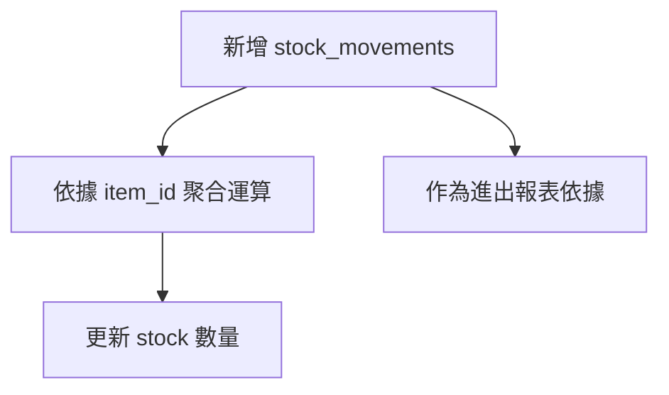

## 目標
- 最簡單的貿易商ERP:商品、庫存、進出

## 步驟
- 只考慮三個表
- 定義實體
- 定義usecase
- 新增redis配置
- 資料庫表設計
- 定義資料存取層（Repository）
  - 定義基礎接口、用jpa實作此接口的基礎類
- 定義redis接口
## 動作
### 最簡單的流程
#### ✅ 最小可運作的表
- items – 商品資料
- stock – 商品目前的庫存狀態（地點 + 數量）
- stock_movements – 商品的進出歷程（時間點 + 數量增減）
#### 流程

#### 實體
```
    很好，若只考慮 **items、stock、stock\_movements 三種表**，並且完全獨立於其他表（例如 location、user、訂單等），我們可以設計成「自洽封閉系統」，以最小欄位達成運作。以下是針對此前提修正後的**極簡實體欄位定義**。

    ---

    ## ✅ Items（商品）

    ```plaintext
    - id: Long          ← 唯一識別碼
    - name: String        ← 商品名稱
    - unit: String        ← 單位（如「個」、「箱」）
    - createdAt: DateTime(3)
    - updatedAt: DateTime(3)
    ```

    ### 💬 說明

    * 不引入 SKU 系統或額外分類
    * 欄位命名保持清晰與通用
    * 每個 item 可由使用者自由新增，不需額外參照表

    ---

    ## ✅ Stock（商品庫存狀態）

    ```plaintext
    - id: Long          ← 唯一識別碼
    - itemId: String       ← 對應 item.id
    - location: String     ← 自由輸入的地點名稱（字串）
    - quantity: - BigDecimal    ← 數量（可為 0，不能為負）
    - createdAt: DateTime(3)
    - updatedAt: DateTime(3)
    ```

    ### 💬 說明

    * `location` 為自由輸入字串，例如 "倉庫A"、"門市1"
    * 不考慮 location 維度資料表，只作為文字辨識
    * 建議組合 `itemId + location` 為唯一鍵

    ---

    ## ✅ StockMovements（庫存變動紀錄）

    ```plaintext
    - id: Long          ← 唯一識別碼
    - itemId: Long        ← 對應 item.id
    - location: String      ← 對應 stock.location（作為字串）
    - type: Integer     ← 入庫=1，出庫=2    
    - quantityChange: BigDecimal  ← 數量變化
    - note: String (optional)  ← 操作備註（可空）
    - createdAt: DateTime(3)
    - updatedAt: DateTime(3)    
    ```

    ### 💬 說明

    * 本表是事件導向，每筆代表一次庫存動作
    * 不引入訂單、操作人、批次等概念
    * 與 `stock` 表無直接外鍵關聯，僅透過 `itemId + location` 間接映射

    ---

    ## ⚙️ 實體間邏輯關係

    * 新增一筆 `stock_movements` 時：

    * 根據 `itemId + location` 找到對應的 stock
    * 若無則建立一筆新的 stock（數量預設 0）
    * 計算變動後的新庫存，更新 `stock.quantity`
    * 所有的進出歷史，都只記錄在 `stock_movements` 表

    ---

    ## 📌 最小設計原則回顧

    | 原則         | 是否滿足 | 說明                                |
    | ---------- | ---- | --------------------------------- |
    | 不依賴其他資料表   | ✅    | location 為字串欄位，自由輸入               |
    | 可追溯歷史紀錄    | ✅    | 所有操作皆透過 stock\_movements 建立       |
    | 即時計算目前庫存   | ✅    | stock 表即為 itemId + location 的總和   |
    | 無需額外流程建表關聯 | ✅    | 不需 joins、關聯表、enumeration tables 等 |


```
#### Use Case：新增一筆庫存異動
```pgsql
1. 取得 Redis 鎖（針對 item_id 或 stock 資源）
2. 開始 DB Transaction
3. 查詢 & 更新 stock 數量（根據 stock_movements）
4. 寫入 stock_movements（保存原始操作記錄）
5. Commit Transaction 或 Rollback（如遇錯誤）
6. 釋放 Redis 鎖（在 transaction 結束後釋放）
```
#### 資料表欄位設計
```sql
-- 商品表 items
CREATE TABLE items (
    id BIGINT AUTO_INCREMENT PRIMARY KEY COMMENT '商品唯一識別碼，自增',
    name VARCHAR(100) NULL COMMENT '商品名稱',
    unit VARCHAR(20) NULL COMMENT '單位（例如個、箱）',
    created_at DATETIME(3) NULL COMMENT '建立時間（毫秒級）',
    updated_at DATETIME(3) NULL COMMENT '更新時間（毫秒級）'
) COMMENT='商品基本資料表';

-- 庫存表 stocks
CREATE TABLE stocks (
    id BIGINT AUTO_INCREMENT PRIMARY KEY COMMENT '庫存記錄唯一識別碼，自增',
    item_id BIGINT NULL COMMENT '對應商品ID',
    location VARCHAR(50) NULL COMMENT '庫存地點名稱（自由文字）',
    quantity DECIMAL(18,6) NULL COMMENT '現有庫存量',
    created_at DATETIME(3) NULL COMMENT '建立時間（毫秒級）',
    updated_at DATETIME(3) NULL COMMENT '更新時間（毫秒級）',
    INDEX idx_item_id (item_id),
    INDEX idx_location (location)
) COMMENT='商品庫存狀態表';

-- 庫存異動紀錄表 stock_movements
CREATE TABLE stock_movements (
    id BIGINT AUTO_INCREMENT PRIMARY KEY COMMENT '庫存異動記錄唯一識別碼，自增',
    item_id BIGINT NULL COMMENT '商品ID',
    location VARCHAR(50) NULL COMMENT '庫存地點名稱（自由文字）',
    type INT NULL COMMENT '異動類型（數字代碼，如入庫=1，出庫=2）',
    quantityChange DECIMAL(18,6) NULL COMMENT '異動數量',
    note TEXT NULL COMMENT '異動備註',
    created_at DATETIME(3) NULL COMMENT '異動發生時間（毫秒級）',
    INDEX idx_item_location_time (item_id, created_at),
    INDEX idx_created_at (created_at)
) COMMENT='商品庫存異動歷史表';
```
#### 定義資料存取層（Repository）
##### 定義基礎接口、用jpa實作此接口的基礎類
```
    ## ✅ Java IBaseRepository\<T, ID>（仿 Phalcon 風格）方法列表（含 count）

    | 方法名稱                                        | 回傳型別          | 說明                        |
    | ------------------------------------------- | ------------- | ------------------------- |
    | `find()`                                    | `List<T>`     | 查詢所有資料                    |
    | `findFirst(Map<String, Object> conditions)` | `Optional<T>` | 查詢符合條件的第一筆資料              |
    | `findById(ID id)`                           | `Optional<T>` | 根據主鍵 ID 查詢單筆資料            |
    | `save(T entity)`                            | `T`           | 新增或更新資料（合併 create/update） |
    | `delete(T entity)`                          | `boolean`     | 刪除資料（可傳入實體）               |
    | `exists(Map<String, Object> conditions)`    | `boolean`     | 判斷是否存在符合條件的資料             |
    | `count(Map<String, Object> conditions)`     | `long`        | 計算符合條件的資料筆數               |

    ```
    ```
    當然，以下是使用 **JPA 搭配 Specification** 實作你所定義的 `IBaseRepository<T, ID>` 接口的基礎類設計思路與說明（純文字）：

    ---

    ## JPA + Specification 實作 IBaseRepository 基礎類設計說明

    ### 1. 核心依賴與技術

    * 使用 **Spring Data JPA** 作為資料存取框架，利用其 `JpaRepository` 作為底層存取接口。
    * 採用 **Spring Data JPA Specification** 來實現動態條件查詢，針對傳入的 `Map<String, Object>` 轉換成 Specification 條件。
    * 所有方法均透過 `JpaRepository` 與 `JpaSpecificationExecutor` 進行操作。

    ---

    ### 2. 方法實作策略

    * **find()**

    * 直接調用 `JpaRepository` 的 `findAll()`，回傳所有資料列表。

    * **findById(ID id)**

    * 調用 `JpaRepository` 的 `findById(id)`，回傳 `Optional<T>`。

    * **save(T entity)**

    * 調用 `JpaRepository` 的 `save(entity)`，執行新增或更新。

    * **delete(T entity)**

    * 調用 `JpaRepository` 的 `delete(entity)`，並可依實作需求回傳刪除結果（boolean，或直接無回傳）。

    * **findFirst(Map\<String, Object> conditions)**

    * 將條件 Map 轉換成 `Specification<T>`，使用 `JpaSpecificationExecutor` 的 `findAll(specification, pageable)`，設定分頁為第一筆，取結果列表的第一筆作為回傳。

    * **exists(Map\<String, Object> conditions)**

    * 透過條件 Map 產生 Specification，調用 `JpaSpecificationExecutor` 的 `count(specification)`，判斷結果是否大於 0。

    * **count(Map\<String, Object> conditions)**

    * 同上，產生 Specification，呼叫 `count(specification)` 回傳筆數。

    ---

    ### 3. Specification 轉換邏輯

    * 需要一套工具方法，負責把 `Map<String, Object>` 的條件動態轉換成 Specification 物件。
    * 可支援等值判斷（`=`），也可擴展支援其他條件（如 `like`、`>`、`in` 等）。
    * 此工具使得 Repository 的查詢方法能靈活處理多種動態查詢需求。

    ---

    ### 4. 類別繼承與組合

    * 實作類會繼承 Spring Data JPA 的 `JpaRepository<T, ID>` 和 `JpaSpecificationExecutor<T>` 兩個接口。
    * 你的基礎 Repository 介面 `IBaseRepository<T, ID>` 由此基礎類實作。
    * 透過組合 Specification，完成動態條件查詢功能。

    ---

    ### 5. 注意事項

    * 條件轉 Specification 的複雜度與彈性會影響維護成本，需適度權衡。
    * 查詢效率可透過合適索引及條件過濾優化。

    ---

    如果需要，我可以協助你設計該條件轉換工具的結構和流程說明。

```
##### 對應三個實體的存取
```
目前沒有特別的需求，使用此結構

* `IBaseRepository<T, ID>`：接口層，定義方法（規範）
* `BaseRepository<T, ID>`：基礎實作層，實作接口方法（基本CRUD+Specification）
* `CommonRepository<T, ID>`：通用擴展層，繼承自 `BaseRepository`，加入額外共用功能或工具方法

這樣分層設計的好處：

1. **清晰職責分離**

   * `IBaseRepository` 是純接口，定義契約
   * `BaseRepository` 提供最核心的 CRUD 和動態查詢功能
   * `CommonRepository` 提供多個實體通用的附加行為

2. **易於維護與擴展**

   * 需要其餘功能（例如日誌、快取、統計方法等），可由`BaseRepository`派生更專屬的實作類

```
#### redis 定義
##### 四個接口
```
只需要 **String、Hash、List、通用鍵操作** 四種類型的 Redis 使用場景，整理出這四個接口的 **基礎必要操作清單**，作為你定義 `IRedisStringRepository` 等接口的依據。

---

## ✅ IRedisKeyRepository（通用鍵操作）

| 方法名稱                   | 功能說明     |
| ---------------------- | -------- |
| exists(key)            | 檢查鍵是否存在  |
| delete(key)            | 刪除鍵（不論其類型）      |
| expire(key, ttl)       | 設定過期時間   |
| persist(key)           | 移除過期時間   |
| ttl(key)               | 取得剩餘生存時間 |
| keys(pattern)          | 取得所有符合 pattern 的鍵名（支援 *, ? 等） |

---

## ✅ IRedisStringRepository

| 方法名稱                  | 功能說明           |
| --------------------- | -------------- |
| set(key, value, ttl)  | 設定字串值並指定過期時間   |
| get(key)              | 取得字串值          |
| incr(key)             | 整數遞增           |
| decr(key)             | 整數遞減           |
| append(key, value)    | 附加字串           |

---

## ✅ IRedisHashRepository

| 方法名稱                           | 功能說明      |
| ------------------------------ | --------- |
| hset(key, field, value)        | 設定單一欄位值   |
| hget(key, field)               | 取得欄位值     |
| hdel(key, fields...)           | 移除欄位      |
| hgetAll(key)                   | 取得整個 Hash |
| hfields(key)                   | 取得所有欄位名稱  |
| hvals(key)                     | 取得所有欄位值   |
| hexists(key, field)            | 檢查欄位是否存在  |
| hincrBy(key, field, increment) | 對數值欄位遞增   |
| hdecrBy(key, field, increment) | 對數值欄位遞減   |

---

## ✅ IRedisListRepository

| 方法名稱                    | 功能說明          |
| ----------------------- | ------------- |
| lpush(key, values...)   | 將元素插入至列表左側    |
| rpush(key, values...)   | 插入至右側         |
| lpop(key)               | 移除並返回左側第一個元素  |
| rpop(key)               | 移除並返回右側第一個元素  |
| lrange(key, start, end) | 取得指定範圍內元素     |
| llen(key)               | 取得列表長度        |
| lindex(key, index)      | 根據 index 取得元素 |
| lrem(key, count, value) | 移除指定數量的特定值    |
| ltrim(key, start, end)  | 截取列表指定範圍      |

---

這些方法組成了每種類型最常用、最基本且業務上可靠的 Redis 操作集合，適合封裝為四個接口，分別交由不同實作或模組擴充使用。

是否也需要我幫你畫出這四個接口與實作層的結構圖（例如：interface → implementation → adapter）？

```
##### 實作
- 一個類 RedisRepository 同時實作多個 Redis 操作接口，並在應用層直接注入這個實作類本身使用。
- 結構
```
2️⃣ 單一實作類：RedisRepository
此類會實作上述四個接口。

使用 @Repository 註解後，可於 @Controller、@UseCase 等處 直接注入具體實作類。

3️⃣ 使用分區區塊（for 可讀性）
分區邏輯寫法：用 //region 與 //endregion

4️⃣ RedisTemplate 實作設定方向
使用 StringRedisSerializer 作為 key 和 value 的序列化機制：

優點：簡單、快速、人類可讀

適用：大部分快取鍵值為字串的場景
```

- 
### 新增redis
- redis 7.4.5
- 增加依賴:spring-boot-starter-data-redis
- 增加spring配置

### 測試
#### 測試用例
```
## Use Case：新增一筆庫存異動 — 測試用例設計

### 1. 正常流程測試

* **目標：** 成功新增一筆庫存異動，且 `stock` 數量正確更新。
* **測試步驟：**

  * 取得 Redis 鎖成功。
  * 在資料庫交易中，查到對應的 `stock` 記錄並更新數量。
  * 新增一筆 `stock_movements` 記錄。
  * Commit 交易。
  * 釋放 Redis 鎖。
* **期望結果：**

  * `stock.quantity` 變動正確反映異動量。
  * `stock_movements` 新增記錄完整。
  * Redis 鎖被正確釋放。

### 2. Redis 鎖取得失敗

* **目標：** 當 Redis 鎖無法取得時，流程中斷並回傳錯誤。
* **測試步驟：**

  * 模擬 Redis 鎖無法取得。
* **期望結果：**

  * 不進行資料庫操作。
  * 回傳鎖取得失敗的錯誤訊息。

### 3. 資料庫更新失敗（Transaction 回滾）

* **目標：** 資料庫更新過程中發生錯誤時，交易正確回滾且釋放鎖。
* **測試步驟：**

  * 模擬更新 `stock` 或新增 `stock_movements` 發生異常。
* **期望結果：**

  * 交易回滾，不更新庫存數量。
  * Redis 鎖仍然被釋放。
  * 回傳錯誤訊息。

### 4. 新增異動時 stock 記錄不存在

* **目標：** 當對應的 `stock` 記錄不存在時，自動建立新記錄並正確更新。
* **測試步驟：**

  * 查無對應 `stock`。
  * 新增 `stock` 並更新數量。
  * 新增 `stock_movements`。
* **期望結果：**

  * 成功新增並更新 `stock` 記錄。
  * 新增正確的異動紀錄。

### 5. 異動數量為負導致庫存量不足（依需求可測）

* **目標：** 若系統限制庫存不可為負，異動數量導致負庫存時流程處理。
* **測試步驟：**

  * 設定庫存量不足。
  * 嘗試新增負數異動。
* **期望結果：**

  * 拒絕異動並回傳錯誤。
  * 不修改庫存。
  * 釋放鎖。

```

## 思考
- 思考整個領域的架構，先從需要幾張表，哪些表開始，不需要具體的欄位
  ```
    ### 核心
    - 📦 商品（什麼貨）what
    - 📊 庫存（現在在哪）where
    - 🕓 進出歷史（何時動了）when
  ```
- 只考慮三個核心表，不加單據、倉庫、客戶等進階設計，目標是讓最簡的庫存邏輯先跑起來。
- 步驟
  - 先明確定義領域實體（Entities）與屬性
  - 設計核心業務邏輯（Use Case）
  - 資料庫表設計，根據實體與業務邏輯，優化資料庫表結構與欄位，越簡單越好，複雜處理交code
  - 定義資料存取層（Repository）
    - 定義接口與設計，目標是封裝資料庫操作，對外提供乾淨的存取方法，讓業務邏輯層能專注使用。
    - 有特殊邏輯再用model包裝entity，若無則直接操作entity
  - 測試驅動 (TDD) 或先寫簡單測試用例
  - 編寫單元測試與整合測試

